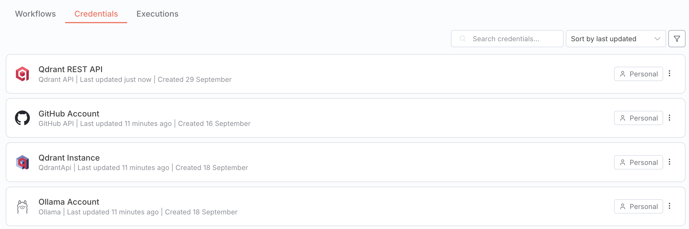
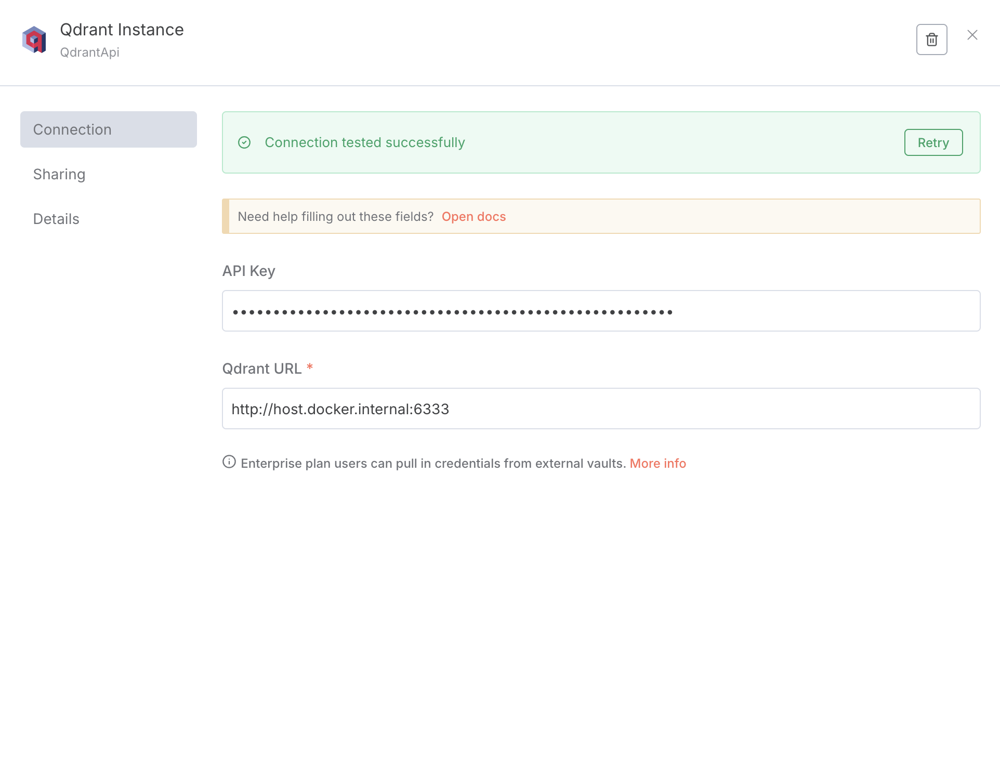
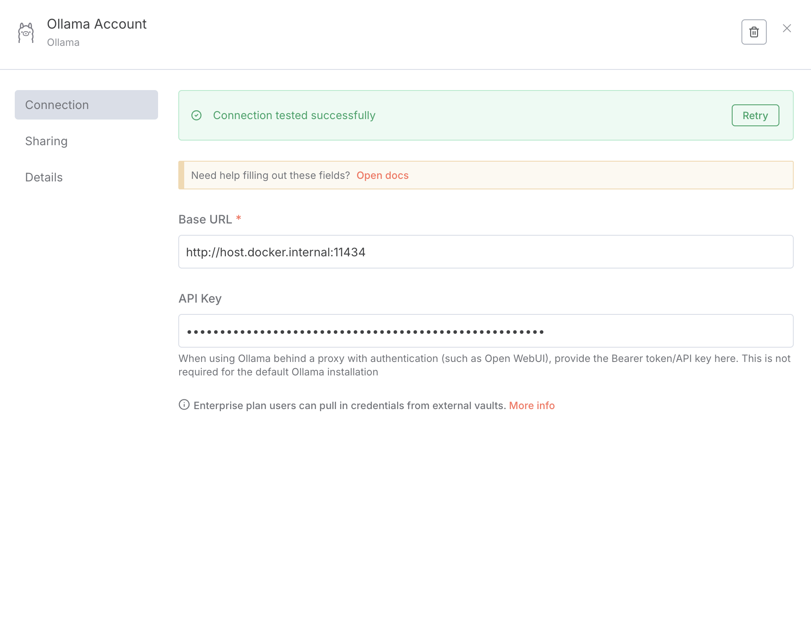
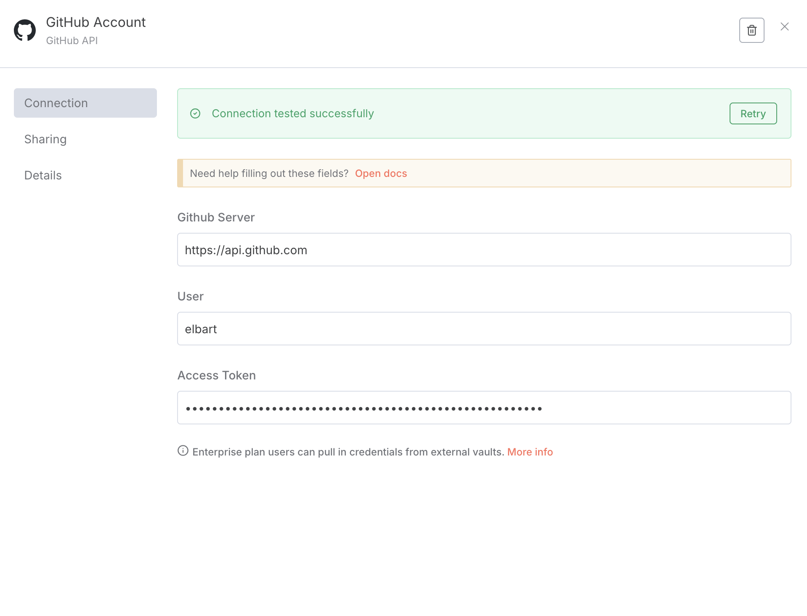

# Minimal N8N + Qdrant RAG example workflow
The docker-compose.yaml was shamelessly copied and adjusted to my needs from https://github.com/n8n-io/self-hosted-ai-starter-kit.

## Prerequisites
- Local ollama installation on port 11434
    - Used models during the flow:
        - Embeddings: `llama3.2:latest`
        - Chat Model: `qwen3-coder:latest`
    - Pull models using:
        ```
        ollama pull llama3.2:latest && ollama pull qwen3-coder:latest
        ```
- Docker or Podman + compose installation
- Start containers with: `docker compose up` or `podman compose up`
- Copy the `.env.example` file to `.env` and adjust the values
- Go to the [N8N UI](http://localhost:5678) and register

## Create Credentials
- Create the credentials as seen below (see `credentials` folder)
- **Note: The fields for the API Keys for the local Ollama & Qdrant instances are actually empty!!!**


### Qdrant
Requires two different credentials because we use two different n8n plugins for different purposes.



### Ollama


### Github


## Workflow import
- Create a new workflow in n8n and import the `n8n-workflow.json` file from this repository.
- Double check the credentials and the workflow configuration.
- Adjust the github repo in the `Github DocumentLoader` node.
- Run the Ingest to Qdrant part ("Execute Workflow")
- Chat with the chat window!
